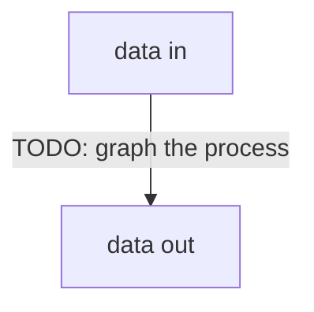

# Architecture

TODO: https://matklad.github.io/2021/02/06/ARCHITECTURE.md.html

// force having an active daemon
// send all messages to the daemon (localhost?)
// daemon accepts messages, updates the local knowledge, then immediately appends to target files
	// - iter over configured channels and groups, if any matches, push them all level down. So for my config it's: top-level: (alerts, 2839885895: (journal, making, trading, general))
// local knowledge diff is pushed to remote when internet access is available

//  currently impossible:
// - every time I'm rerequesting the currently available tg messages, we clean the message pipe cache
